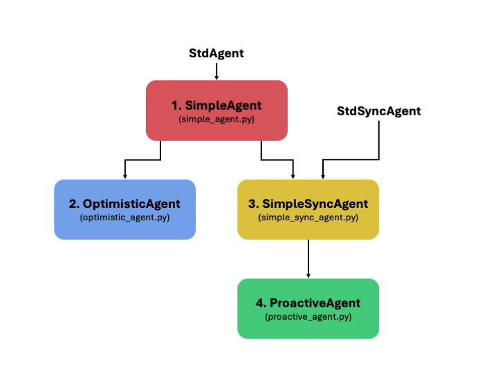

# エージェントクラス構造と戦略ドキュメント

このドキュメントは、SCML2025向けに実装された各エージェントクラスの継承構造と戦略、主要機能を詳述したものです。

## クラス継承構造

以下は、本プロジェクトで使用されるエージェントクラスの継承関係図です：



## 1. SimpleAgent

**定義ファイル**：`simple_agent.py`  
**継承元クラス**：StdAgent

- **戦略概要**：
  `SimpleAgent` は基本的な交渉戦略を持つ貪欲型（Greedy）エージェントであり、交渉相手からのオファーに対して、自らの必要量（ニーズ）と現在のステップに応じた許容可能な価格かどうかを評価して、受け入れまたは拒否を行います。必要な量に対して提案を生成する機能を持ち、交渉タイミングに応じた価格の譲歩（コンセッション）も行います。

- **主な機能・メソッド**：
  - `propose()`：提案生成の起点。内部の `good_offer()` を用いて需要に基づくオファーを返す。
  - `respond()`：受け取ったオファーを `is_needed()`（量）と `is_good_price()`（価格）に基づいて判断。
  - `good_offer()`：自分の需要と価格譲歩戦略に基づいてオファーを構築。
  - `is_needed()`：その時間に必要とする量を計算。階層（first/last/middle）により異なる。
  - `is_good_price()`：価格が現在の譲歩レベルに見合っているかを評価。

- **実行方法**：
  - python -m myagent.simple_agent

## 2. OptimisticAgent

**定義ファイル**：`optimistic_agent.py`  
**継承元クラス**：`SimpleAgent`

- **戦略概要**：
  `OptimisticAgent` は「楽観的」なアプローチをとるエージェントであり、現時点で良好な提案を受け入れつつも、より良い提案が将来提示されることを期待して、交渉を継続する柔軟な戦略を採用します。

- **主な戦略ポイント**：
  - `propose()`：現在のニーズ・契約済み量・ラインの稼働状態に基づいて提案を行う。
  - `respond()`：価格と数量の両面から判断し、提案が理想的でなければ交渉を継続。
  - `expected_quantity()`：自分が必要とする数量を推定（既契約量との差異を計算）。
  - `expected_price()`：自分が許容可能と考える価格レンジをステップ進行に応じて評価。

- **実行方法**：
  - python -m myagent.optimistic_agent

## 3. SimpleSyncAgent

**定義ファイル**：`simple_sync_agent.py`  
**継承元クラス**：StdSyncAgent, SimpleAgent

- **戦略概要**：
  `SimpleAgent` を拡張し、`StdSyncAgent` を併せて継承することで、時系列（ステップ同期）型の交渉環境に適応したエージェントです。
  `SimpleAgent` の提案生成や評価戦略はそのまま利用しながら、同期的な交渉モデル（ステップ単位で進行）に対応する機能を持ちます。

- **設計の特徴**：
  - `StdSyncAgent` を通じて、交渉相手とのステップベースでのメッセージ交換・管理が行える。
  - `SimpleAgent` の価格・需要戦略と組み合わせることで、柔軟かつ基本的な同期交渉エージェントとなる。

- **実行方法**：
  - python -m myagent.simple_sync_agent


**定義ファイル**：`proactive_agent.py`  
**継承元クラス**：SimpleSyncAgent

- **戦略概要**：
  `ProactiveAgent` は将来を見据えた積極的な（proactive）戦略を取ります。現在のニーズをもとに、自ら提案する先を75%のパートナーに絞ってランダムに分配し、その他は将来的な提案（未来時点）をサンプルすることで、よりよい契約機会を模索します。

- **交渉方針の特徴**：
  - 初期オファー (`first_proposals`)：ニーズをパートナーにランダムに割り当てて送信。
  - 反応戦略 (`counter_all`)：全パートナーのオファー集合を評価し、最適組合せ（powerset）を探索。ニーズに最も近いセットを選び、受け入れ。満たされない場合は再提案か終了を選択。
  - `sample_future_offer()`：交渉対象と将来の時点で結べるランダムな契約を生成し、柔軟性を持たせている。
  - `distribute_todays_needs()`：生産レベルや階層に応じて、現在必要な資源や販売量をランダムに各パートナーへ分配。
  - `threshold` パラメータ：需要との差が小さいほど受け入れやすくなり、柔軟な妥協を可能にする。

- **実行方法**：
  - python -m myagent.proactive_agent


## test.pyを用いたエージェントの実行方法

上記の各エージェントは、共通の `test.py` スクリプトを通じて以下のように実行することも可能です。

```bash
python -m myagent.test <エージェントクラス名>
```

例：
```bash
python -m myagent.test SimpleAgent
```

実行結果のプロットは `myagent/fig/<エージェントクラス名>/` 以下に保存されます。